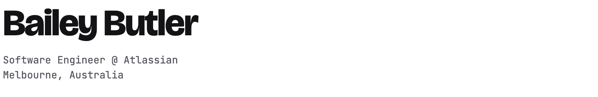

<picture>
  <source media="(prefers-color-scheme: dark)" srcset="assets/banner-dark.png">
  
</picture>

[LinkedIn](https://linkedin.com/in/baileybutler1) | [Instagram](https://instagram.com/bae1y) | [Letterboxd](https://letterboxd.com/baely) | [Blog](https://blog.baileys.dev)

---

<picture>
  <source media="(prefers-color-scheme: dark)" srcset="assets/header-personal-dark.png">
  
</picture>

### 🏢 [Officetracker](https://github.com/baely/officetracker) | [Live](https://officetracker.com.au)
Calendar-based RTO tracking with stats & compliance reports.  
`Go` `PostgreSQL` `Redis` `Auth0` `Google Cloud Run`

### 💸 [Txn](https://github.com/baely/txn)
Event-driven system monitoring my banking activities via the Up Banking API:
- [IsBaileyButlerInTheOffice.Today?](https://isbaileybutlerintheoffice.today) - Tracks office presence via coffee purchases
- [Bailey Needs Coffee](https://baileyneeds.coffee) - Coffee consumption analytics

`Go` `PostgreSQL` `EDA`

### ⚙️ [Infrastructure](https://github.com/baely/infra)
Self-hosted infrastructure as code.  
`IaC` `Docker`

### 🧩 [Advent of Code](https://github.com/baely/advent-of-code)
Python and Java solutions to annual Advent of Code challenges.  
`Python` `Java`

<picture>
  <source media="(prefers-color-scheme: dark)" srcset="assets/header-devhouse-dark.png">
  
</picture>

### 📝 [Blog](https://github.com/devhou-se/www-jp) | [Live](https://devhou.se)
Blogging platform with GitHub issues integration and auto-translation for Japanese.  
`Hugo` `Go` `Python` `Firebase`

### 🎮 [Game](https://github.com/devhou-se/game) | [Live](https://game.devhou.se)
Game development with Godot engine.  
`Godot` `C#` `GDScript`
